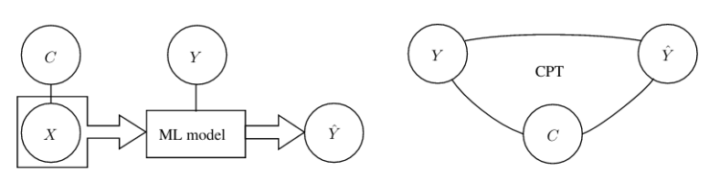

# About mlconfound

The lack of rigorous non-parametric statistical tests of confoudner-effects significantly hampers the development of
robust, valid and generalizable predictive models in many fields of research.
The package `mlconfound` implements the *partial* and *full confounder tests* [1], that build on a recent theoretical framework of conditional 
independence testing [2] and test the null hypothesis of \emph{no bias} and \emph{fully biased model}, respectively.
The proposed tests set no assumptions about the distribution of the predictive model output that is often non-normal.
As shown by theory and simulations, the test are statistically valid, robust and display a high statistical power.

#### References
[1] *Tamas Spisak, A conditional permutation-based approach to test confounder effect and center-bias in machine learning
models, in prep, 2021*

[2] *Berrett, T. B., Wang, Y., Barber, R. F., and Samworth, R. J. (2020). The conditional permutation test for
independencewhile controlling for confounders.Journal of the Royal Statistical Society: 
Series B (Statistical Methodology),82(1):175–197.*