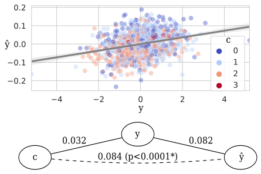

.. mlconfound documentation master file, created by
   sphinx-quickstart on Fri Aug  6 13:49:20 2021.
   You can adapt this file completely to your liking, but it should at least
   contain the root `toctree` directive.

Welcome to the docs of 'mlconfound'! |GitHub stars|
==========

|GitHub license| |GitHub release| |GitHub CI| |Documentation Status| |arXiv| |GitHub issues| |GitHub issues-closed|

Tools for analyzing and quantifying effects of counfounder variables on machine learning model predictions.

`More details <about.html>`_

Install
-------

From `PyPI <https://pypi.org/project/mlconfound>`_:

.. code-block:: bash

   pip install mlconfound

`More details <install.html>`_

Example
--------
.. code-block:: python

   from mlconfound.stats import partial_confound_test

   partial_confound_test(y, yhat, c)

`More details <quickstart.html>`_

Source
-------
`https://github.com/pni-lab/mlconfound <https://github.com/pni-lab/mlconfound>`_

Citation
--------

T. Spisak, "Statistical quantification of confounding bias in machine learning models." GigaScience 11 (2022)  https://doi.org/10.1093/gigascience/giac082.
Preprint on `arXiv:2111.00814 <http://arxiv-export-lb.library.cornell.edu/abs/2111.00814>`_, 2021.

Navigation
--------

.. toctree::
   about.md
   install.md
   quickstart.md
   docs.md
   :maxdepth: 1

Documentation index
------------------

* :ref:`genindex`
* :ref:`modindex`
* :ref:`search`

.. |GitHub license| image:: https://img.shields.io/github/license/pni-lab/mlconfound.svg
   :target: https://github.com/pni-lab/mlconfound/blob/master/LICENSE

.. |GitHub release| image:: https://img.shields.io/github/release/pni-lab/mlconfound.svg
   :target: https://github.com/pni-lab/mlconfound/releases/

.. |GitHub CI| image:: https://github.com/pni-lab/mlconfound/actions/workflows/ci.yml/badge.svg
   :target: https://github.com/pni-lab/mlconfound/actions/workflows/ci.yml/badge.svg

.. |Documentation Status| image:: https://readthedocs.org/projects/mlconfound/badge/?version=latest
   :target: https://mlconfound.readthedocs.io/en/latest/?badge=latest

.. |arXiv| image:: https://img.shields.io/badge/arXiv-2111.00814-<COLOR>.svg
   :target: https://arxiv.org/abs/2111.00814

.. |GitHub issues| image:: https://img.shields.io/github/issues/pni-lab/mlconfound.svg
   :target: https://GitHub.com/pni-lab/mlconfound/issues/

.. |GitHub issues-closed| image:: https://img.shields.io/github/issues-closed/pni-lab/mlconfound.svg
   :target: https://GitHub.com/pni-lab/mlconfound/issues?q=is%3Aissue+is%3Aclosed

.. |GitHub stars| image:: https://img.shields.io/github/stars/pni-lab/mlconfound.svg?style=social&label=Star&maxAge=2592000
   :target: https://GitHub.com/pni-lab/mlconfound/stargazers/
