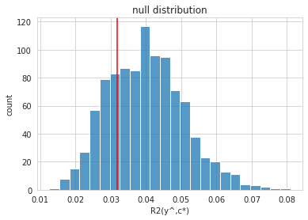
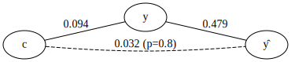
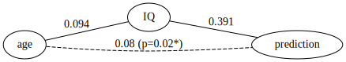

Quickstart
==========

The partial and full confound tests can characterize whether a
predictive model (e.g. a machine learning model) is biased by the
confounder variable.

In research using predictive modelling techniques, confounder-bias is
often investigated (if investigated at all) by testing the association
between the confounder variable and the predictive values. However, the
significance of this association does not necessarily imply a
significant confound-bias of the model, especially if the confounder is
also associated to the true target variable. In this case, namely, the
model still might not be directly driven by the confounder, i.e. the
dependence of the predictions on the confounder can be explained solely
by the confounder-target association. Put simply, this is what is tested
by the proposed partial confounder test.

Here we will apply the ``partial confound test`` on two simulated
datasets: - H0: null-hypothesis dataset with no confounder bias,
i.e. conditional independence between the predicted values and the
confounder variable, given the observed target variable. Note that the
(unconditional) association between the prediction and the target are
significant but - according to the H0 of the partial confoudner test -
can be fully explained by the association between the target and the
confounder. - H1: alternative hypothesis with an explicit confounder
bias. Here, the association between the predictions and the confounder
is stronger than what could follow form the association between the
target and the confounder.

Import the necessary packages
'''''''''''''''''''''''''''''

.. code:: ipython3

    from mlconfound.stats import partial_confound_test
    from mlconfound.simulate import simulate_y_c_yhat
    from mlconfound.plot import plot_null_dist, plot_graph
    
    import pandas as pd
    import seaborn as sns
    sns.set_style("whitegrid")

H0 simulations
''''''''''''''

Next, we simulate some data from the null hypothesis.

The simulation samples ``y`` and ``c`` (``n`` datapoints each) from the
multivariate normal distribution, so that their correlation is
``cov_y_c``. Next, a ‘prediction’ of y is simulated like this:

::

   yhat = y_ratio_yhat * y + c_ratio_yhat * c + e

where ``e`` is random standard-Gaussian noise.

For the H0 simulation, ``c_ratio_yhat`` is set to zero.

.. code:: ipython3

    H0_y, H0_c, H0_yhat = simulate_y_c_yhat(cov_y_c=0.3,
                          y_ratio_yhat=0.5, c_ratio_yhat=0,
                          n=500, random_state=42)

Partial confound test
'''''''''''''''''''''

Now let’s perform the partial confounder tests on this data. The number
of permutations and the steps in the Markov-chain Monte Carlo process
set to the default values (1000 and 50, respectively). Increase the
number of permutations for more accurate p-value estimates.

The random seed is set for reproducible results. The flag
``return_null_dist`` is set so that the full permutation-based null
distribution is returned, e.g. for plotting purposes.

.. code:: ipython3

    ret=partial_confound_test(H0_y, H0_yhat, H0_c, return_null_dist=True,
                      random_state=42)

.. parsed-literal::

    Permuting: 100%|██████████| 1000/1000 [00:02<00:00, 457.42it/s]

.. raw:: html

    

    
    <table border="1" class="dataframe">
      <thead>
        <tr style="text-align: right;">
          <th></th>
          <th>p</th>
          <th>ci lower</th>
          <th>ci upper</th>
          <th>R2(y,c)</th>
          <th>R2(y^,c)</th>
          <th>R2(y,y^)</th>
        </tr>
      </thead>
      <tbody>
        <tr>
          <th>0</th>
          <td>0.798</td>
          <td>0.771754</td>
          <td>0.822478</td>
          <td>0.094132</td>
          <td>0.031789</td>
          <td>0.478693</td>
        </tr>
      </tbody>
    </table>
    

Let’s use the built-in plot functions of the package ``mlconfound`` for
a graphical representation of the results.

.. code:: ipython3

    plot_null_dist(ret)

.. parsed-literal::

    <AxesSubplot:title={'center':'null distribution'}, xlabel='R2(y^,c*)', ylabel='count'>

The histogram shows the :math:`R^2` values between the predictions and
the permuted confounder variable (conditional permutations). The red
line indicates that the unpermuted :math:`R^2` is not “extreme”, i.e. we
have no evidence against the null (:math:`p=0.8`).

.. code:: ipython3

    plot_graph(ret)

The graph shows the unconditional :math:`R^2` values across the target
:math:`y`, confounder :math:`c` and predictions :math:`\hat{y}`.

H1 simulations and test
'''''''''''''''''''''''

No let’s apply the partial confounder test for H1, that is for a
confounded model.

.. code:: ipython3

    H1_y, H1_c, H1_yhat = simulate_y_c_yhat(cov_y_c=0.3,
                          y_ratio_yhat=0.4, c_ratio_yhat=0.1,
                          n=500, random_state=42)

    ret=partial_confound_test(H1_y, H1_yhat, H1_c, num_perms=1000, return_null_dist=True,
                      random_state=42, n_jobs=-1)

.. parsed-literal::

    Permuting: 100%|██████████| 1000/1000 [00:01<00:00, 759.92it/s]

.. raw:: html

    

    
    <table border="1" class="dataframe">
      <thead>
        <tr style="text-align: right;">
          <th></th>
          <th>p</th>
          <th>ci lower</th>
          <th>ci upper</th>
          <th>R2(y,c)</th>
          <th>R2(y^,c)</th>
          <th>R2(y,y^)</th>
        </tr>
      </thead>
      <tbody>
        <tr>
          <th>0</th>
          <td>0.015</td>
          <td>0.008419</td>
          <td>0.02462</td>
          <td>0.094132</td>
          <td>0.079504</td>
          <td>0.390694</td>
        </tr>
      </tbody>
    </table>
    

.. code:: ipython3

    plot_null_dist(ret)

    # The labels on the graph plot can be customized:
    plot_graph(ret, y_name='IQ', yhat_name='prediction', c_name='age', outfile_base='example')

.. image:: _static/quickstart_13_1.png

The low p-value provides evidence against the null hypothesis of
:math:`y` being conditionally independent on :math:`c` given :math:`y`
and indicates that the model predictions are biased.

+-----------------------------------------------------------------------+
| Note                                                                  |
+-----------------------------------------------------------------------+
| For parametric corrections for multiple comparisons (e.g. false       |
| discovery rate in case of testing many                                |
| confounders), permutation based p-values must be adjusted if they are |
| zero. A decent option could be in this case to use the upper binomial |
| confidence limit (``p_ci[1]``), instead.                              |
+-----------------------------------------------------------------------+

References
~~~~~~~~~~

*Tamas Spisak, A conditional permutation-based approach to test
confounder effect and center-bias in machine learning models, in prep,
2021.*
